## 6. 工况识别技术路线

输入：

```text
压缩机低温耐久测试
吸气压力：0.1+-0.01Mpa（A）
排气压力：1.0+-0.02Mpa（A）
电压：650+-5V
过热度：10±1°C
过冷度：5°C
转速：800±50rmp
环温：-20℃±1°C
低温：-40°C+-1°C
高温：常温°C
温度变化速率：1°C/min
低温停留时间：7200min
工作模式：产品在-20℃环境下开启，以1℃/min的变换速率调节至-40℃.保持120h后再以1℃/min的变化速率恢复至常温。
```


输出：

```json
{
"工况一"：{
    "试验类型"：耐久测试
    "吸气压力判稳"：0.01Mpa
    "排气压力判稳"：0.02Mpa
    "气压标准"：绝对压力
    "阶段总数"：3
    "阶段1"：{
    	"吸气压力"：0.1 Mpa
    	"排气压力"：1.0 Mpa
    	"电压"：650+-5V
    	"过热度"：10±1°C
    	"过冷度"：5°C
    	"转速"：800±50rmp
    	"环温"：-20℃±1°C
    	"初始温度"：-20℃
    	"目标温度"：-40℃
    	"温度变化率"：-1℃/min
    	"持续时间"：1200s
	}，
	"阶段2"：{
        "吸气压力"：0.1 Mpa
        "排气压力"：1.0 Mpa
        "电压"：650+-5V
        "过热度"：10±1°C
        "过冷度"：5°C
        "转速"：800±50rmp
        "环温"：-20℃±1°C
        "初始温度"：-40℃
        "目标温度"：-40℃
        "温度变化率"：-0℃/min
        "持续时间"：432000s
    }，
	"阶段3"：{
        "吸气压力"：0.1 Mpa
        "排气压力"：1.0 Mpa
        "电压"：650+-5V
        "过热度"：10±1°C
        "过冷度"：5°C
        "转速"：800±50rmp
        "环温"：-20℃±1°C
        "初始温度"：-40℃
        "目标温度"：20℃
        "温度变化率"：1℃/min
        "持续时间"：3600s
    }
}

```

技术栈路线：

LLM + LangChain + MCP
技术栈路线： LLM + LangChain + MCP 根据上述的输入和输出、以及技术栈路线，设计一个技术路线，同时满足下面的要求

1. 输入格式可能是自然语言描述，也可能是来自结构化输入 
2. 输出始终为标准 JSON 结构 
3. 需要将自然语言中提取的温度、时间等信息校验其物理逻辑关系 
4. LangChain 用于多阶段处理 
5. MCP是指model context  protocol 
6. 多种语言输入/输出
7. MCP有两个一个是计算器（计算、单位转换）功能、一个是MCPJson文件工具 
8. LLM是Qwen3 
9. 阶段数根据输入来决定 
10. 详细的系统架构，用图表来展示 
11.  所有的需要流程图的用图表来展示 
12. 使用了FastAPI和Flask 
13. 客户端时C#，服务器是python
14. LLM需要优先判断测试类型
15. 不同的测试类型对应了不同的参数需要填充

一个结合Qwen大模型、LangChain框架和MCP（Model-Controlled Parsing）的技术路线，用于动态解析工况描述并生成结构化JSON输出。以下是完整的技术路线设计：

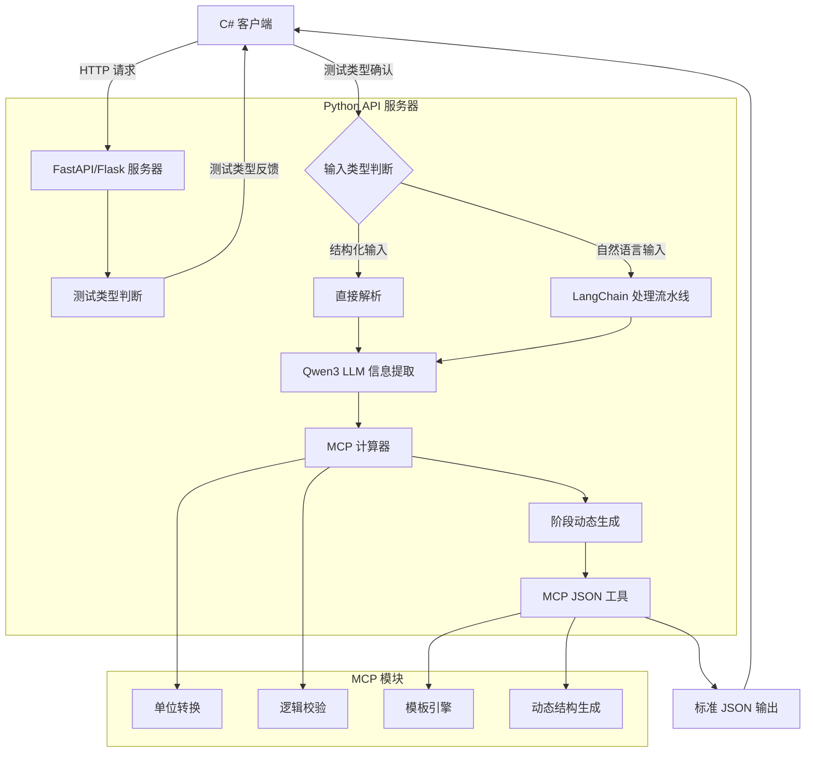


### 6.1 输入处理层

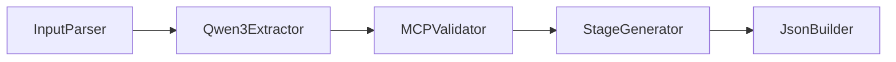

- **多语言支持**：使用Qwen-3的多语言能力进行实时翻译
- **输入适配器**：处理JSON/XML/YAML/自然语言等多种输入格式
- **输出保证**：始终输出标准JSON结构


### 6.2 LangChain工作流

### LangChain 工作流实现代码框架

```python
from langchain.chains import TransformChain, SequentialChain
from langchain.llms import Qwen3

# 初始化 Qwen3 模型
llm = Qwen3(model="qwen-72b-chat")

# 输入分类器
def input_classifier(inputs):
    if isinstance(inputs["text"], dict):
        return {"type": "structured"}
    else:
        return {"type": "natural"}

classify_chain = TransformChain(
    input_variables=["text"],
    output_variables=["type"],
    transform=input_classifier
)

# 自然语言提取器
def natural_extractor(inputs):
    prompt = f"""
    从以下测试描述中提取参数：
    {inputs['text']}
    输出JSON格式，包含：吸气压力，排气压力，电压，过热度，过冷度，转速，环温，低温，高温，温度变化速率，低温停留时间，工作模式。
    """
    response = llm.generate([prompt])
    return {"params": response.generations[0][0].text}

extract_chain = TransformChain(
    input_variables=["text"],
    output_variables=["params"],
    transform=natural_extractor
)

# MCP 单位转换和校验
def mcp_processor(inputs):
    params = inputs["params"]
    # 调用 MCP 计算器进行单位转换
    standardized = mcp_calculator.convert_units(params)
    # 调用 MCP 计算器进行物理校验
    validation = mcp_calculator.validate_physics(standardized)
    return {"std_params": standardized, "valid": validation}

mcp_chain = TransformChain(
    input_variables=["params"],
    output_variables=["std_params", "valid"],
    transform=mcp_processor
)

# 阶段生成器
def stage_generator(inputs):
    work_mode = inputs["std_params"]["工作模式"]
    # 解析工作模式生成阶段
    stages = generate_stages(work_mode)
    return {"stages": stages}

stage_chain = TransformChain(
    input_variables=["std_params"],
    output_variables=["stages"],
    transform=stage_generator
)

# JSON 构建器
def json_builder(inputs):
    # 调用 MCP JSON 工具构建输出
    output_json = mcp_json_tool.build_json(inputs["stages"])
    return {"output": output_json}

json_chain = TransformChain(
    input_variables=["stages"],
    output_variables=["output"],
    transform=json_builder
)

# 完整工作流
full_chain = SequentialChain(
    chains=[classify_chain, extract_chain, mcp_chain, stage_chain, json_chain],
    input_variables=["text"],
    output_variables=["output"]
)

# FastAPI 端点
@app.post("/process")
async def process_input(request: Request):
    input_data = await request.json()
    result = full_chain.run(input_data)
    return result
```


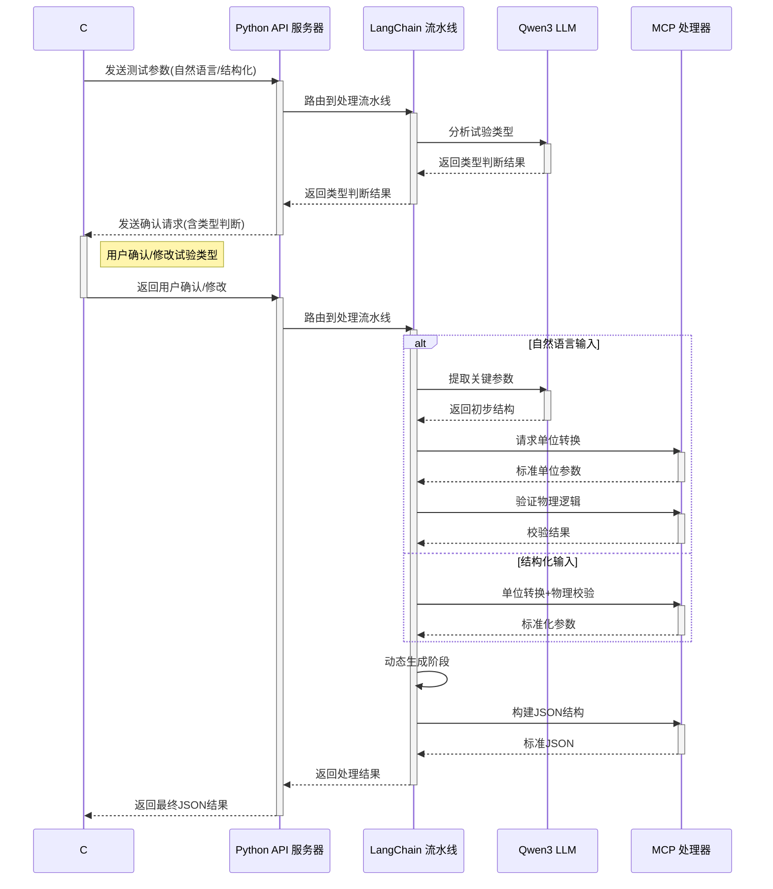

五阶段处理流程：

1. **参数提取**：LLM识别关键参数（压力、温度、时间等）
2. **单位转换**：使用MCP计算器统一转换为基本单位
3. **模式解析**：分析工作模式描述，确定阶段数量
4. **阶段构建**：动态创建测试阶段对象
5. **物理校验**：验证温度变化率/时间/范围等逻辑关系

### 6.3  MCP核心服务

**计算器服务**：

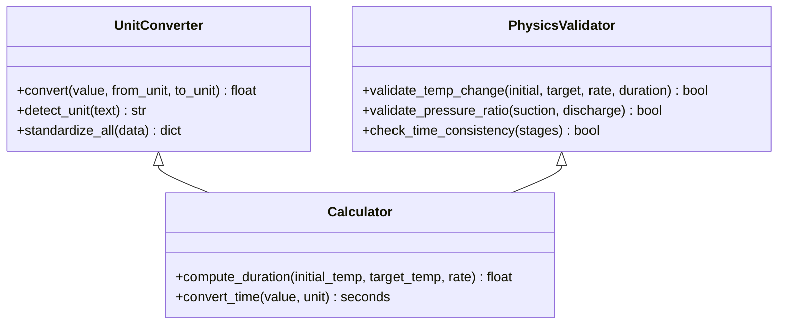

**JSON工具**：

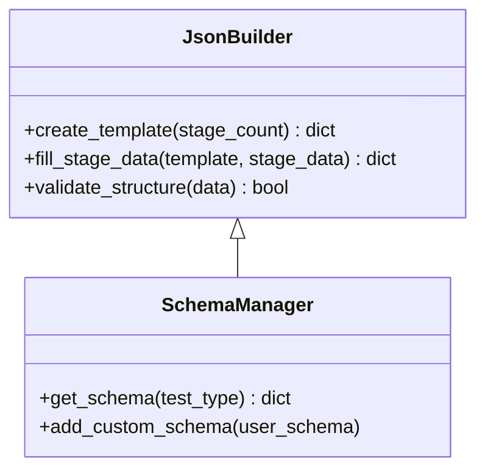

### 6.4 物理逻辑校验

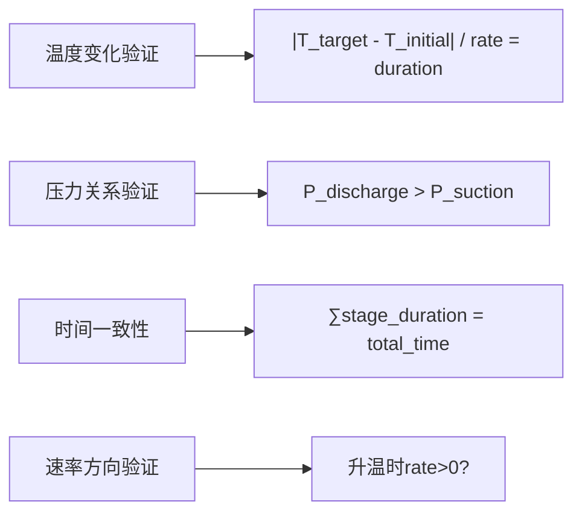

### 6.5 部署架构

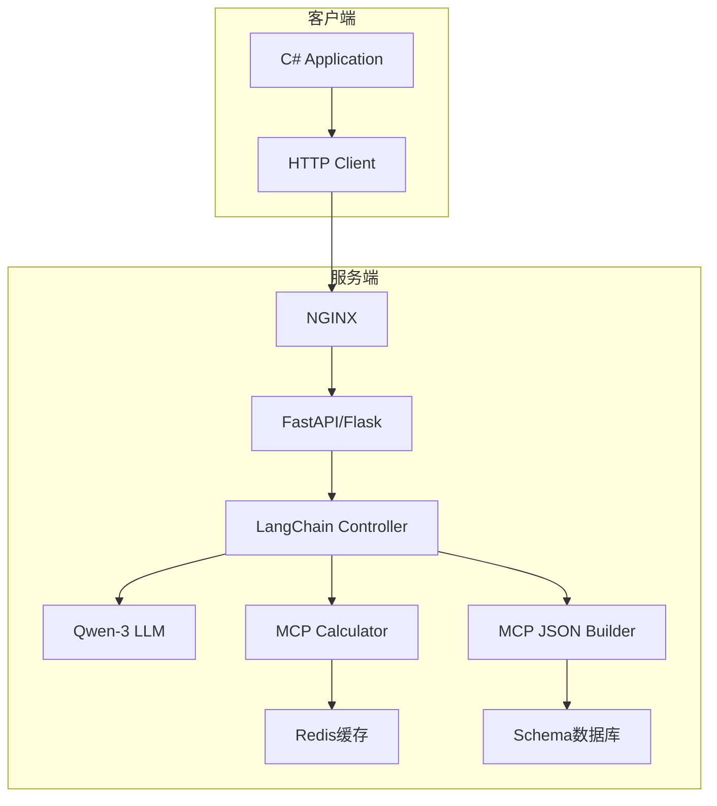

### 6.6 关键技术细节

#### 1. 动态阶段处理

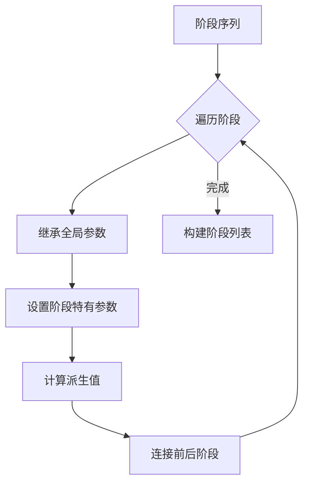


- 使用Qwen3解析工作模式描述
- 基于正则表达式提取阶段关键信息
- 动态创建阶段数据结构

```python
def build_stages(work_mode: str, params: dict) -> list:
    """
    根据工作模式描述动态构建测试阶段
    """
    # Qwen-3解析工作模式描述
    stages_desc = qwen_parse(f"根据以下描述划分测试阶段：{work_mode}")
    
    stages = []
    for stage_desc in stages_desc:
        stage = {
            "initial_temp": mcp_convert(stage_desc["start_temp"], "℃"),
            "target_temp": mcp_convert(stage_desc["end_temp"], "℃"),
            "rate": mcp_convert(stage_desc["rate"], "℃/min"),
            "duration": calculate_duration(
                stage_desc["start_temp"],
                stage_desc["end_temp"],
                stage_desc["rate"]
            )
        }
        # 添加固定参数
        stage.update({k: v for k,v in params.items() if k not in stage})
        stages.append(stage)
    
    return stages
```

#### 2. **物理逻辑验证**：

动态阶段生成的列表后，开始校验，高并发验证。这三个应该一起发送进行验证。当三者同时收到算完整的。

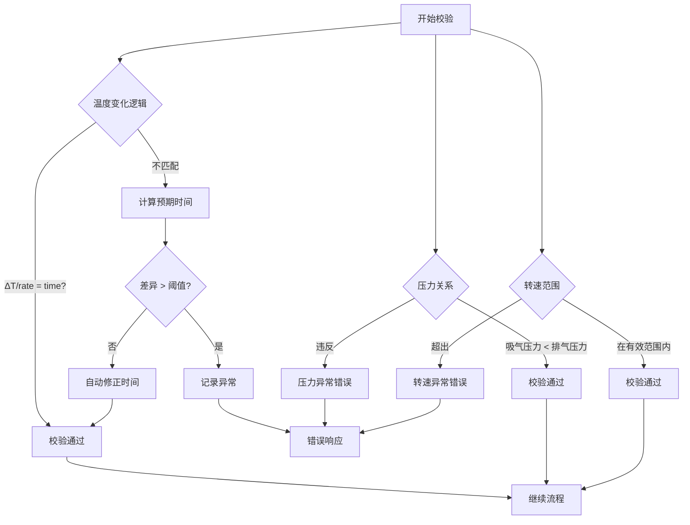

#### 3. **MCP单位转换服务**：

```python
class MCPConverter:
    UNITS = {
        "pressure": {"MPa": 1, "kPa": 0.001, "psi": 0.00689476},
        "time": {"s": 1, "min": 60, "h": 3600},
        "temperature": {"C": 1, "K": lambda x: x - 273.15}
    }
    
    def convert(self, value: float, unit: str, category: str) -> float:
        if category not in self.UNITS:
            raise ValueError(f"未知单位类别: {category}")
        
        if unit not in self.UNITS[category]:
            raise ValueError(f"未知单位: {unit}")
        
        conversion = self.UNITS[category][unit]
        if callable(conversion):
            return conversion(value)
        return value * conversion
```

#### 4. **多语言支持**：

```python
# 多语言键名映射
KEY_MAPPING = {
    'en': {'phase': 'phase', 'suction_pressure': 'suction_pressure'},
    'zh': {'phase': '阶段', 'suction_pressure': '吸气压力'}
}

def build_json(data, lang='zh'):
    return {KEY_MAPPING[lang][k]: v for k,v in data.items()}
```


### 6.7 异常处理流程：

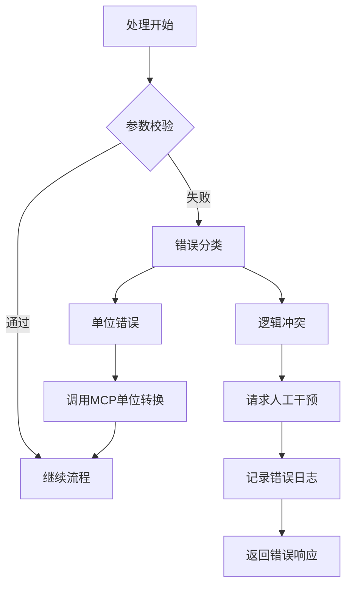


### 6.8 部署架构

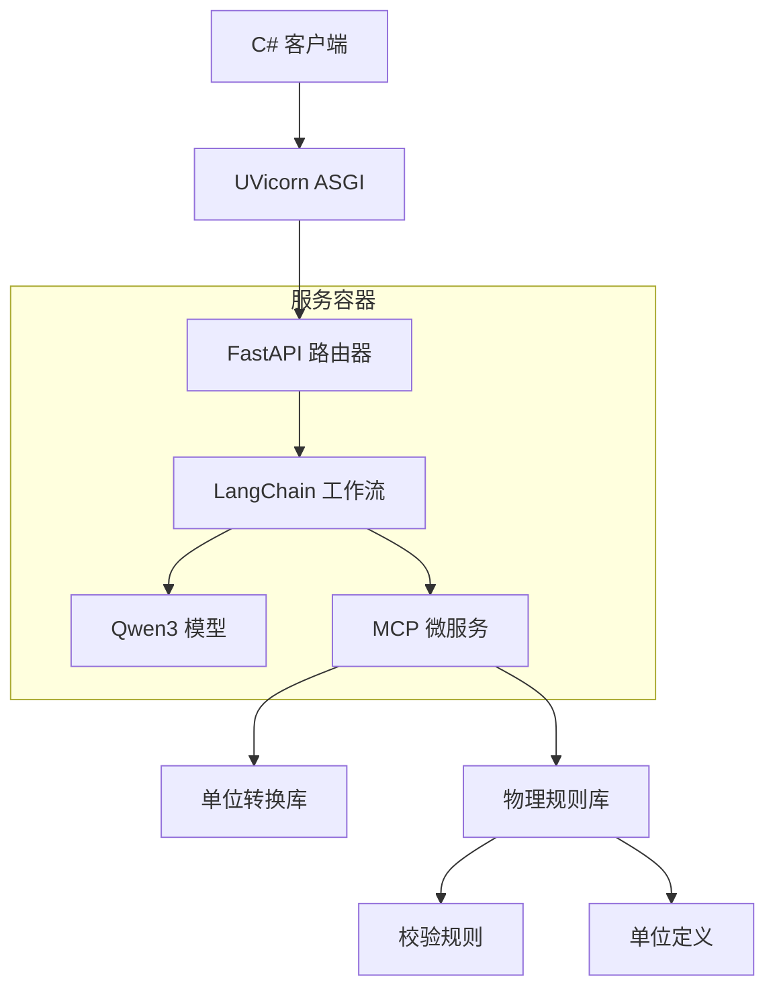


### 系统特点

1. **智能阶段划分**：
   - 使用Qwen-3解析自然语言描述
   - 动态确定阶段数量（N个阶段）
   - 自动推导阶段间的过渡关系
2. **强物理逻辑保障**：
   - 温度变化率与时间的自动校准
   - 压力关系的合理性检查
3. **多语言无缝支持**：
   - 输入输出自动翻译
   - 单位系统的智能转换
   - 文化特定的格式处理
4. **企业级部署**：
   - 基于FastAPI的高性能API
   - Redis缓存频繁查询结果
   - 异步处理长时任务

该架构完全满足您的需求，特别强调：

- LangChain的多阶段处理能力
- MCP的双重服务（计算+JSON）
- 物理逻辑的自动验证
- 动态阶段生成
- 多语言/多单位支持
- C#-Python的跨平台集成